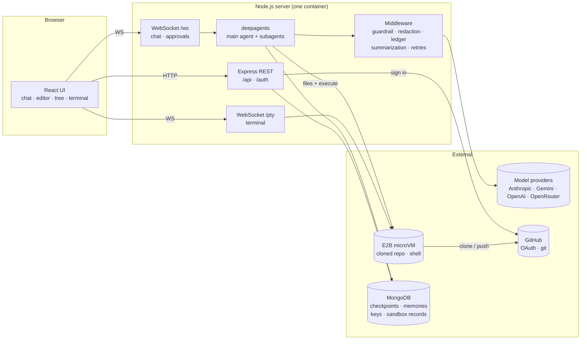

# Code Migration Agents

A web IDE for AI-assisted code migrations, built on LangChain's [`deepagents`](https://github.com/langchain-ai/deepagentsjs) (JS).

Open a project — a local folder or a GitHub repository — and chat with an agent that reads, searches, edits and tests the code. Every file write and shell command stops for your approval first. A team of specialized subagents and a live migration ledger make it purpose-built for migrations such as **Express → FastAPI** or **Mongoose → Pydantic/Motor**, but it works as a general-purpose coding agent too.

---

## Contents

- [Features](#features)
- [Architecture](#architecture)
- [Tech stack](#tech-stack)
- [Project structure](#project-structure)
- [Getting started](#getting-started)
- [Configuration](#configuration)
- [Authentication](#authentication)
- [How the agent works](#how-the-agent-works)
- [Where the agent runs (sandbox)](#where-the-agent-runs-sandbox)
- [Where data is stored](#where-data-is-stored)
- [Security model](#security-model)
- [Tests and evaluations](#tests-and-evaluations)
- [Deployment](#deployment)
- [Troubleshooting](#troubleshooting)
- [Known limitations](#known-limitations)
- [Roadmap](#roadmap)

---

## Features

### Agent
- **Multi-provider models** — Anthropic Claude, Google Gemini, OpenAI and any model on OpenRouter, switchable per workspace.
- **Real token streaming** for every provider, with a **Stop** button that aborts generation mid-turn.
- **11 specialized subagents** — analyzer, dependency mapper, converter, verifier, security reviewer, fixer and more (see [Subagents](#subagents)).
- **Agent Skills** — migration playbooks loaded on demand by description (see [Skills](#skills)).
- **Migration ledger** — per-file status (`pending` → `converted` → `verified` / `failed` / `skipped`) that survives across turns and shows as badges in the file tree.
- **Todo / plan panel** driven by the agent's own task list.
- **Long-run ready** — automatic conversation summarization near the context limit, model retries with backoff for rate limits, and a tool-call budget that stops a stuck loop.
- **Memories** — a `/memories/` area the agent can keep notes in across projects, private to each user.
- **Project instructions** — a repo's own `.deepagents/AGENTS.md` is merged into the system prompt automatically.

### Safety
- **Human approval** for every `write_file`, `edit_file`, `delete` and `execute` — with an editable Monaco **diff view** for proposed writes — and for every GitHub tool that acts (pushing files, merging a PR, deleting a file). GitHub tools the server labels read-only run without asking.
- **Path rules** — auto-approve writes into an output folder, and always ask before touching legacy source.
- **Read provenance** — each approval card lists the files the agent read just before proposing the action, and flags text in those files that addresses an AI agent (a prompt-injection signal).
- **Credential redaction** — API keys, tokens and connection strings found in project files are masked before anything is sent to a model provider.
- **Scope guardrail** — clearly off-topic requests are declined before any model call is spent.
- **Sandboxed execution** — on a deployment, all agent commands run in a disposable **E2B microVM** with an outbound-network allowlist, never on the server.

### Workspaces
- **Local folders** (development) or **GitHub repositories** (`https://github.com/user/repo`, optionally `#branch`).
- **Live subagent cards** — one per delegated task, showing which subagent, what it was asked, the tools it is calling as it works, and whether it is working, waiting for you, done, failed or stopped. Parallel subagents each get their own card.
- **Changes** panel listing every file that differs from the last commit — added, modified, deleted or renamed, whether by a file tool or a shell command — with a diff for each.
- **Interactive terminal** in the same place the agent works (local shell, or inside the sandbox).
- **Sandbox reconnect** — reloading the page or redeploying the server reconnects you to the same sandbox, edits intact; an abandoned sandbox is shut down after 10 minutes.
- **Chat history restore** — reopening a project replays its conversation, todos, ledger and any pending approval.
- **Edit & resend** any earlier message; **New Chat** to start over.

### Accounts (GitHub login)
- **Sign in with GitHub**, limited to an allowlist of usernames.
- **My keys** — each user saves their own model API keys and GitHub token, **encrypted** on the server and never shown again.
- **Private per user** — conversations, migration ledgers, memories, sandboxes, files and terminals are isolated between users.
- **No PAT needed** for private repos — the GitHub login itself clones.

### Interface
- Resizable file tree / editor / chat panels with persisted widths.
- Filterable file tree with migration-status badges.
- Markdown chat with code copy buttons, timestamps and expandable error cards.
- Monaco editor and xterm terminal load only when first opened, keeping the first screen light.
- Works over plain HTTP (no secure-context-only browser APIs are required).

---

## Architecture



**One turn, end to end:**

1. The browser sends `user_message` over `/ws`.
2. The server runs the deepagents graph with live streaming (`agent.stream`, `updates` + `messages` modes).
3. Middleware checks scope and redacts credentials before each model call.
4. Tool calls run against the workspace backend — the E2B sandbox, or the local disk in development.
5. A write or shell command raises a LangGraph **interrupt**; the browser shows an approval card and resumes the graph with the decision.
6. State is checkpointed after every step, so the conversation survives reloads and redeploys.

---

## Tech stack

| Layer | Technology |
| --- | --- |
| Agent | `deepagents` 1.x, LangGraph, LangChain middleware |
| Models | `@langchain/anthropic`, `@langchain/google-genai`, `@langchain/openai` (also used for OpenRouter) |
| Backend | Node.js 20+, TypeScript, Express, `ws`, `node-pty` |
| Frontend | React, Vite, TypeScript, Tailwind CSS, Monaco Editor, xterm.js, react-markdown |
| Sandbox | E2B (`e2b` SDK) |
| Persistence | MongoDB (`@langchain/langgraph-checkpoint-mongodb`) or local SQLite |
| Tests | Vitest (unit), custom eval runner (real model calls) |
| Deploy | Docker, GitHub Actions, Amazon ECR + ECS (EC2), SSM Parameter Store |

---

## Project structure

```
.
├── apps/
│   ├── server/                     Node/TypeScript backend
│   │   ├── src/
│   │   │   ├── server.ts           HTTP server, routes, WebSocket upgrade, graceful shutdown
│   │   │   ├── ws.ts               chat protocol: workspaces, streaming, approvals, history replay
│   │   │   ├── terminal.ts         /pty terminal (local PTY or E2B PTY)
│   │   │   ├── auth.ts             auth modes, session cookies, allowlist, origin checks
│   │   │   ├── userSecrets.ts      encrypted per-user key store
│   │   │   ├── security/crypto.ts  session signing (HMAC) and key encryption (AES-256-GCM)
│   │   │   ├── workspaceRegistry.ts which workspaces each user may read
│   │   │   ├── routes/             files, providers, GitHub login, "me"/keys, Gemini proxy
│   │   │   └── agent/
│   │   │       ├── index.ts        builds the deep agent (backends, middleware, subagents)
│   │   │       ├── subagents.ts    subagent definitions
│   │   │       ├── prompts/        system prompt and one prompt per subagent (.md)
│   │   │       ├── e2bSandbox.ts   E2B backend adapter (path mapping, reconnect, keep-alive)
│   │   │       ├── sandboxSession.ts sandbox ownership, grace period, reconnect records
│   │   │       ├── persistence.ts  MongoDB / SQLite checkpoints and memories
│   │   │       ├── gitWorkspace.ts clone and push (local or in the sandbox)
│   │   │       ├── workspaceChanges.ts changed files since the last commit, for the Changes panel
│   │   │       ├── subagentTracker.ts live subagent cards from the run's stream
│   │   │       ├── askUser.ts      ask_user tool
│   │   │       ├── pendingInterrupts.ts every waiting approval/question, answered by id
│   │   │       ├── decisions.ts    approval answers and denial messages
│   │   │       ├── toolFailures.ts tool error handling and safe retries
│   │   │       ├── ledger.ts       record_migration tool + ledger state
│   │   │       ├── guardrails.ts   off-topic request guardrail
│   │   │       ├── secretRedaction.ts credential redaction middleware
│   │   │       ├── tracing.ts      LangSmith tracing with credential masking
│   │   │       └── injectionSignals.ts agent-directed text detection
│   │   ├── skills/                 Agent Skills (migration playbooks)
│   │   └── evals/                  behavioural evaluations + fixture repository
│   └── web/                        React + Vite frontend
│       └── src/
│           ├── App.tsx             workspace session, socket handling, layout
│           ├── components/
│           │   ├── auth/           sign-in gate, My keys panel, user menu
│           │   ├── chat/           chat, approval cards, diff editor, ledger, todos
│           │   ├── editor/         file tree, Monaco editor
│           │   ├── terminal/       xterm terminal
│           │   ├── workspace/      workspace picker, folder browser
│           │   └── layout/         header, resizable panels, system info
│           └── lib/                API/auth client, WebSocket client, browser helpers
├── packages/shared/                TypeScript types shared by server and web (protocol schema)
├── deploy/ecs/                     ECS task definition + AWS setup guide
├── .github/workflows/deploy.yml    CI/CD: test → build → ECR → ECS
├── Dockerfile                      single image: built frontend served by the backend
└── docker-compose.yml              single-host alternative to ECS
```

---

## Getting started

### Prerequisites
- **Node.js 20+** and npm
- At least one model API key (Anthropic, Google, OpenAI or OpenRouter)
- Optional: an **E2B** API key (sandboxed execution), a **MongoDB** URI (e.g. free Atlas M0)

### Install

```bash
npm install
cp .env.example .env
```

Put at least one model key in `.env`:

```env
ANTHROPIC_API_KEY=sk-ant-...
GOOGLE_API_KEY=...
OPENAI_API_KEY=sk-...
OPENROUTER_API_KEY=sk-or-...
```

A key can also be typed into the workspace picker for one session instead.

### Run locally

In two terminals:

```bash
npm run dev:server
```

```bash
npm run dev:web
```

Open **http://localhost:5173**, enter a local folder path (or a GitHub URL), pick a provider and model, and click **Open Workspace**.

Vite proxies `/api`, `/auth`, `/ws` and `/pty` to the backend on port 4000, so the browser only ever talks to one origin. To share a local instance, tunnel port 5173 (for example `ngrok http 5173`).

### Migration settings (optional)

When opening a workspace:

- **Output folder** — globs where writes are auto-approved (e.g. `/migrated/**, /out/**`).
- **Legacy source** — globs where writes always need approval, even if an output glob matches (e.g. `/legacy/**, /src/**`).

Shell commands always require approval. Pasted or browsed absolute paths are converted to globs automatically.

### Build for production

```bash
npm run build          # shared → server → web
npm run start:server   # serves the API and the built frontend on PORT
```

---

## Configuration

All settings are environment variables (`.env` locally; SSM Parameter Store and the task definition on AWS). See [`.env.example`](.env.example) and [`.env.production.example`](.env.production.example).

### Models

| Variable | Purpose |
| --- | --- |
| `ANTHROPIC_API_KEY`, `GOOGLE_API_KEY`, `OPENAI_API_KEY`, `OPENROUTER_API_KEY` | Server model keys. Used in local and shared-token modes only — **never** for GitHub-login users. |
| `ANTHROPIC_MODEL`, `GOOGLE_MODEL`, `OPENAI_MODEL`, `OPENROUTER_MODEL` | Default model shown in the picker for each provider. |

### Server and access

| Variable | Purpose |
| --- | --- |
| `PORT` | HTTP port (default `4000`). |
| `CLOUD_MODE` | `1` on any public deployment: refuses to start without authentication or without E2B sandboxes, opens only GitHub repositories (never a folder on the host), and disables the local folder browser. |
| `ALLOWED_ORIGINS` | Comma-separated origins allowed for CORS and cookie-authenticated requests. |
| `AUTH_TOKEN` | Shared access token (shared-token mode). |
| `GITHUB_OAUTH_CLIENT_ID`, `GITHUB_OAUTH_CLIENT_SECRET` | Enable GitHub login. |
| `APP_SECRET` | ≥ 32 characters. Signs session cookies and encrypts saved keys. |
| `PUBLIC_URL` | Where the app is reached, e.g. `http://13.202.56.144`; the OAuth callback is built from it. |
| `ALLOWED_GITHUB_USERS` | Comma-separated GitHub usernames allowed to sign in (`*` = anyone). |

### Sandbox and storage

| Variable | Purpose |
| --- | --- |
| `SANDBOX_PROVIDER` | `e2b` to run agent work in E2B microVMs; unset for the local disk. |
| `E2B_API_KEY` | E2B API key. |
| `MAX_SANDBOXES_PER_USER`, `MAX_SANDBOXES` | Sandboxes one user, and the whole server, may run at once (defaults `2` and `10`). Idle ones are closed first to make room. |
| `MONGODB_URI` | MongoDB connection string; unset uses local SQLite and files. |
| `MONGODB_DB` | Database name (default `deepagents`); use a different one per environment. |
| `LANGSMITH_TRACING`, `LANGSMITH_API_KEY` | Both set: trace every agent run to LangSmith. See [Tracing](#tracing). |
| `LANGSMITH_PROJECT`, `LANGSMITH_ENDPOINT`, `LANGSMITH_TRACING_SAMPLING_RATE` | Project (default `code-migration-agents`), EU endpoint, fraction of runs traced. |
| `LANGSMITH_HIDE_INPUTS`, `LANGSMITH_HIDE_OUTPUTS` | `true` sends no code or messages — only each step's shape, timing, tokens and errors. |

### Tracing

With LangSmith tracing on, each agent run appears as one trace: every model call, tool call and subagent (nested under its `task` call), with token counts, timing and errors. Runs are tagged with metadata `user_id`, `user_login`, `workspace` and `model`, and the tag `model:<provider>`, so one user's or one repository's runs can be filtered, and threads are grouped by conversation.

Traces contain the source code the agent read and wrote. Before upload, credentials are masked with LangSmith's secret rules plus the patterns used for model-side redaction — a trace records each tool's raw result, so a committed `.env` would otherwise be sent as-is. The code itself is not masked; set `LANGSMITH_HIDE_INPUTS` and `LANGSMITH_HIDE_OUTPUTS` to keep it on the server. The server logs at startup whether tracing is on and what it sends, and flushes queued traces on shutdown.

---

## Authentication

The mode is chosen from configuration:

| Mode | Enabled when | Who is a "user" | Model keys used |
| --- | --- | --- | --- |
| **GitHub login** | `GITHUB_OAUTH_CLIENT_ID` is set | each GitHub account on the allowlist | only the user's own (saved in **My keys** or typed per session) |
| **Shared token** | `AUTH_TOKEN` is set | everyone with the token is one user | the server's keys, or one typed per session |
| **None** | neither is set | local development only | the server's keys |

The server refuses to start if GitHub login is half-configured, or if `CLOUD_MODE=1` has no authentication or no E2B sandbox configured.

### Setting up GitHub login

1. Create an OAuth App at **GitHub → Settings → Developer settings → OAuth Apps**:
   - Homepage URL: your `PUBLIC_URL`
   - Authorization callback URL: `<PUBLIC_URL>/auth/github/callback`
2. Generate a client secret.
3. Set `GITHUB_OAUTH_CLIENT_ID`, `GITHUB_OAUTH_CLIENT_SECRET`, `APP_SECRET`, `PUBLIC_URL` and `ALLOWED_GITHUB_USERS`.

Generate `APP_SECRET` with:

```bash
node -e "console.log(require('crypto').randomBytes(32).toString('hex'))"
```

The login requests the `repo` and `read:user` scopes, so private repositories can be cloned without a personal access token. A PAT saved in **My keys** is only needed for the agent's GitHub tools (issues, PRs, search via GitHub's MCP server) or different permissions.

Users are identified by GitHub's numeric id, not their username, so a renamed or re-registered username can never inherit someone else's data. Removing a username from `ALLOWED_GITHUB_USERS` locks that user out on their next request. Rotating `APP_SECRET` signs everyone out and makes saved keys unreadable (users save them again).

---

## How the agent works

### Approvals

`write_file`, `edit_file`, `delete` and `execute` pause the agent through deepagents' `interruptOn` and LangGraph's interrupt/resume. The card offers **Approve**, **Deny** and **Edit** — for writes, a Monaco diff editor where **Save & Approve** writes your edited version. **Deny** asks for an optional reason; the agent (or the subagent that asked) receives it as the action's result and tries another way instead of repeating it.

When the agent needs a decision only you can make — a target version, whether to keep something — it calls `ask_user`. The run pauses on a question card with suggested answers and a text box, and continues with your answer. Subagents running in parallel can each be waiting on their own approval or question; every card is answered separately, and the run resumes once all of them are. **Always Approve** skips the prompt for that tool for the rest of the session.

Subagents without shell access get framework-enforced filesystem permissions instead of prompts.

### Subagents

| Subagent | Role |
| --- | --- |
| `analyzer` | Surveys the legacy codebase's structure and stack |
| `dependency-mapper` | Traces module and package dependencies to decide migration order |
| `pattern-cataloguer` | Catalogues recurring code patterns to migrate |
| `converter` | Performs the code conversion |
| `config-migrator` | Migrates configuration, build and environment files |
| `test-migrator` | Migrates the test suite |
| `verifier` | Checks converted output for parity and returns a pass / fail / partial verdict |
| `security-reviewer` | Compares migrated code with its source for protections lost in translation (read-only) |
| `fixer` | Repairs issues the verifier reports |
| `skill-author` | Turns a finished migration into a reusable playbook; may only write under `/skills/mine/` |
| `general-purpose` | Replaces the framework's built-in general subagent with one that follows this app's rules |

Prompts live in [`apps/server/src/agent/prompts/`](apps/server/src/agent/prompts/) as Markdown.

### Skills

Skills in [`apps/server/skills/`](apps/server/skills/) are mounted read-only at `/skills/builtin/`, since every user's agent loads them. Playbooks written by `skill-author` go to the signed-in user's own library at `/skills/mine/` and override a shipped one of the same name for that user only. Only each skill's `name` and `description` sit in context; the agent reads the body when a description matches the work. Nothing names a skill by path, so adding a directory is all it takes.

| Kind | Skills |
| --- | --- |
| Cross-cutting (any stack) | `migration-safety`, `http-api-parity`, `test-parity` |
| Path-specific | `express-to-fastapi`, `mongoose-to-pydantic-motor`, `jest-to-pytest` |

Prefer cross-cutting skills when adding your own. The format is documented in [`apps/server/skills/README.md`](apps/server/skills/README.md).

### Middleware

| Middleware | What it does |
| --- | --- |
| Scope guardrail | Declines clearly off-topic requests before any model call |
| Todo list | Maintains the plan shown in the todo panel |
| Migration ledger | Adds the `record_migration` tool and per-file status |
| Secret redaction | Masks credentials in tool results and messages before they reach the provider |
| Summarization | Summarizes older turns at 70% of the model's context window |
| Model retry | 3 retries with 5–40 s backoff, sized for free-tier rate-limit windows |
| Tool retry | Retries transient tool failures |
| Tool-call limit | Ends a run after 150 tool calls |
| Model fallback | Tries fallback models when the primary fails, if a workspace sets `fallbackModels` (protocol option; not in the picker yet) |

### Backends

The agent's filesystem is a `CompositeBackend`:

| Path | Backed by |
| --- | --- |
| `/` (default) | The project — the E2B sandbox, or the local folder in development |
| `/skills/builtin/` | Bundled skills, read-only to every agent |
| `/skills/mine/` | The user's own skills: MongoDB store namespaced per user, or local files |
| `/memories/` | MongoDB store namespaced per user, or local files |
| `/large_tool_results/`, `/conversation_history/` | Thread state, so internal bookkeeping never lands in your repository |

---

## Where the agent runs (sandbox)

| | `SANDBOX_PROVIDER` unset | `SANDBOX_PROVIDER=e2b` |
| --- | --- | --- |
| Agent files and shell | this machine, inside the workspace | an E2B microVM |
| Terminal | a PTY on this machine | a PTY in the microVM |
| Repository clone | `apps/server/.data/repos/` (per user under GitHub login) | `/home/user/project` in the microVM |
| Workspace input | local folder or GitHub URL | GitHub URL |

Leave it unset for local development. Use `e2b` on every deployment: deepagents documents `LocalShellBackend` as for dedicated development environments only, because `execute` runs with the server's own privileges.

**Network:** outbound traffic from the sandbox is denied by default and allowed only to GitHub, npm, PyPI and Debian package hosts (`EGRESS_ALLOWLIST` in [`e2bSandbox.ts`](apps/server/src/agent/e2bSandbox.ts)).

**Lifecycle:**

| Event | What happens |
| --- | --- |
| Open a GitHub workspace | Reuses your running sandbox for that project, reconnects to one a previous server process left, or creates and clones a new one |
| Workspace open | Lifetime refreshed every 5 minutes |
| Tab closed or project switched | Kept for a **10-minute grace period**, then killed |
| Two tabs on one project | Shared; the grace period starts only when both are closed |
| Server redeploy | Sandboxes are detached, not killed; users reconnect after the restart |
| Nobody returns | E2B reclaims it when the grace period runs out |

Sandboxes are owned by a user. Another user's `e2b://<id>` resolves to nothing in the file routes and the terminal.

---

## Where data is stored

| Data | `MONGODB_URI` unset | `MONGODB_URI` set |
| --- | --- | --- |
| Conversations, todos, migration ledger | `apps/server/.data/sessions.sqlite` | MongoDB checkpoints (deleted after 30 days untouched) |
| `/memories/` | `apps/server/.data/memories/` (shared) | MongoDB store, namespaced per user |
| Saved user keys (encrypted) | `apps/server/.data/user-secrets.json` | `user_secrets` collection |
| Sandbox reconnect records | in memory | `sandboxes` collection (expire after 1 day) |
| Survives container replacement | No | Yes |

Under GitHub login, conversation threads are keyed by user **and** project, so two people opening the same repository each get their own history.

---

## Security model

| Threat | Mitigation |
| --- | --- |
| Open URL gives strangers a shell | GitHub login with allowlist, or a shared token; the server refuses to start public without auth |
| Session theft by page scripts | Session cookie is `HttpOnly`, `SameSite=Lax`, `Secure` over HTTPS, HMAC-signed, 7-day expiry |
| Other sites acting as the user (CSRF, cross-site WebSocket) | Trusted `Origin` required on state-changing requests and WebSocket handshakes under GitHub login |
| Login CSRF | OAuth `state` value bound to a short-lived cookie |
| Database leak exposes API keys | AES-256-GCM with a key derived from `APP_SECRET`; each ciphertext bound to its user and key name |
| One user reading another's work | Threads, memories, workspace registry, sandboxes and clone directories are all per user |
| Users spending the operator's model credits | Under GitHub login, server model keys are never used — not even as a fallback |
| Agent runs something destructive | Approval on every write and command; E2B isolation on deployments |
| Prompt injection in repository files | Read provenance on approval cards, agent-directed text flagged, sandbox egress allowlist |
| Secrets in code sent to providers | Credential redaction before every model call |
| Terminal leaks server secrets | PTY runs with an allowlisted environment only |
| Path traversal in file routes | Roots must be registered by the server for that user; paths resolved and contained |
| Token in a repo URL | Refused; clone/push tokens passed through a credential helper, never in `.git/config` or command lines |

---

## Tests and evaluations

```bash
npm test --workspace=apps/server       # unit tests — no model calls, no network
npm run eval --workspace=apps/server   # behavioural evals — real model calls
npm run eval --workspace=apps/server -- injection   # one group of cases
```

**Unit tests** cover the pieces where a silent break is expensive: session signing and key encryption, authentication modes, the allowlist, origin checks, the OAuth state check, per-user workspace and sandbox isolation, the sandbox grace period and reconnect, refusing server keys under GitHub login, path containment, E2B path mapping, the scope guardrail, credential redaction, agent-directed text detection and skill frontmatter.

**Evals** run the real agent against a fixture repository in `apps/server/evals/fixtures/` and assert behaviour: an instruction embedded in a source comment is reported rather than obeyed, off-topic requests are declined, files are read before being described, the right skill is found by description, and credentials are not echoed. Nothing is executed — the runner rejects every interrupt.

Prompts are this product's behaviour, so a prompt change should come with an eval run.

---

## Deployment

### AWS: GitHub Actions → ECR → ECS (current setup)

```
git push (aws branch)
  → GitHub Actions: install → build (type-checks both apps) → unit tests
  → build Docker image → push to Amazon ECR
  → register task definition → update ECS service → wait until healthy
```

| Piece | Detail |
| --- | --- |
| Compute | One EC2 instance (`t3.small`) registered in an ECS cluster; no load balancer |
| Address | Elastic IP `13.202.56.144` |
| Image | Amazon ECR, last 5 images kept |
| Secrets | SSM Parameter Store (`/deep-agents/*`, SecureString), read by ECS at container start |
| CI → AWS | GitHub OIDC role — no AWS keys stored in GitHub |
| Health | Container health check on `/api/health`; deployment circuit breaker rolls back failed releases |
| Logs | CloudWatch `/ecs/deep-agents-app`, 7-day retention |

Every push to `aws` deploys automatically, with about a minute of downtime while the container is replaced. Step-by-step setup, required secrets and everyday operations are in **[`deploy/ecs/README.md`](deploy/ecs/README.md)**.

### Single host with Docker Compose

```bash
cp .env.production.example .env.production   # fill in values
docker compose up -d --build
```

Maps host port 80 to the container and keeps SQLite data in a volume. Do not run it on a host that is also an ECS container instance — both need port 80.

### Frontend on a separate host

Set `VITE_SERVER_URL` to the backend origin and add the frontend origin to `ALLOWED_ORIGINS`. This works with shared-token mode; GitHub login expects the frontend and API on one origin, because its session cookie is `SameSite=Lax`.

---

## Troubleshooting

| Symptom | Cause and fix |
| --- | --- |
| Blank page over HTTP with `crypto.randomUUID is not a function` | An old build; current builds avoid secure-context-only APIs. Redeploy. |
| GitHub Actions: `Not authorized to perform sts:AssumeRoleWithWebIdentity` | The deploy role's trust policy `sub` must use GitHub's ID format: `repo:<owner>@<ownerId>/<repo>@<repoId>:ref:refs/heads/aws`. See `deploy/ecs/README.md`. |
| Deploy waits forever at "Run one task and wait until healthy" | Port 80 on the host is taken (e.g. an old Docker Compose container). Stop it and re-run the deploy job. |
| New task fails to start, deploy rolls back | A parameter in the task definition's `secrets` is missing from SSM, or GitHub login is half-configured. Check the CloudWatch log. |
| Sign-in returns "not allowed" | Add the GitHub username to `ALLOWED_GITHUB_USERS` and redeploy. |
| "No … API key saved" when opening a workspace | Under GitHub login each user needs their own key: **My keys** → save it. |
| Saved keys show as not saved after a change | `APP_SECRET` was rotated; save the keys again. |
| `git clone failed in sandbox` for a private repo | Sign out and in again to refresh GitHub access, or save a PAT in **My keys**. |

---

## Known limitations

- **No HTTPS yet** on the current AWS address — cookies and tokens travel unencrypted until CloudFront (or another TLS terminator) is in front.
- **Stop** aborts generation and prevents further steps, but a shell command already running finishes in the background.
- The **terminal** is not approval-gated — what you type runs immediately, like any terminal. It opens only in your own workspace, with an allowlisted environment.
- **E2B lifetime caps** — a sandbox lives at most 1 hour on E2B's free Hobby plan (24 hours on Pro), so very long migrations can lose it.
- The **diff editor** compares against the file on disk, not unsaved edits in an editor tab.
- **Conversations from before GitHub login** were not tied to a user and don't appear once it is enabled; they expire after 30 days.
- **SQLite growth** (local mode) — checkpoints store full state per step and are never pruned; clear a project's chat or `VACUUM` to reclaim space.
- `node-pty`'s prebuilt binary is verified on Windows; in sandbox mode the terminal uses E2B's PTY instead.

---

## Roadmap

- HTTPS via CloudFront, then restrict the instance's port 80 to CloudFront only
- Terminal sessions that survive a page reload
- Per-user usage visibility (tokens and sandbox time)
